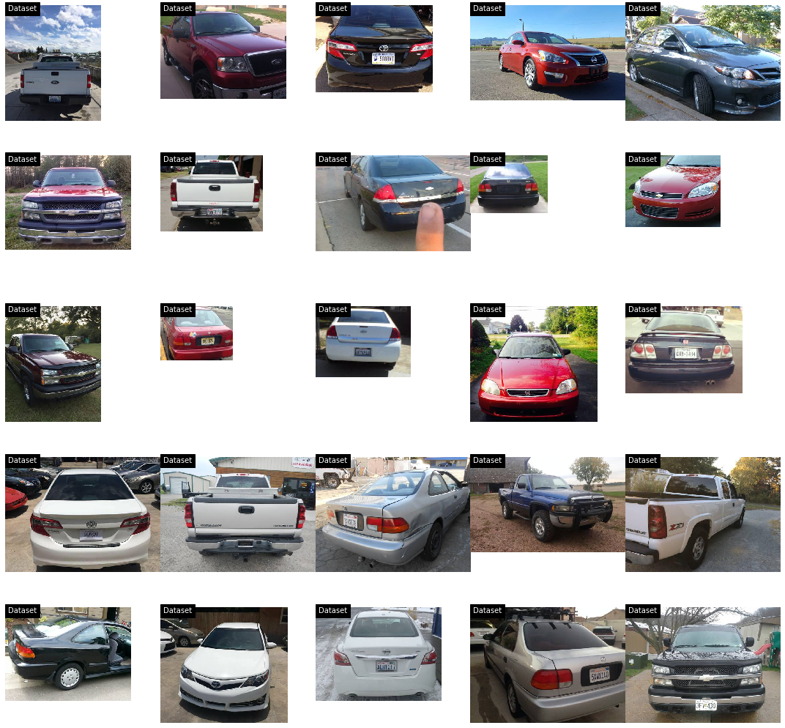
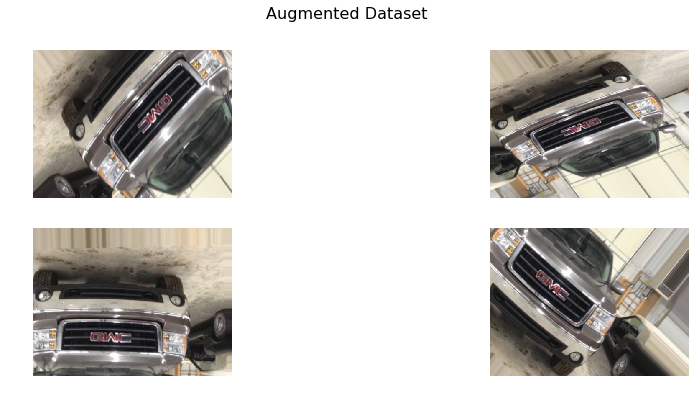
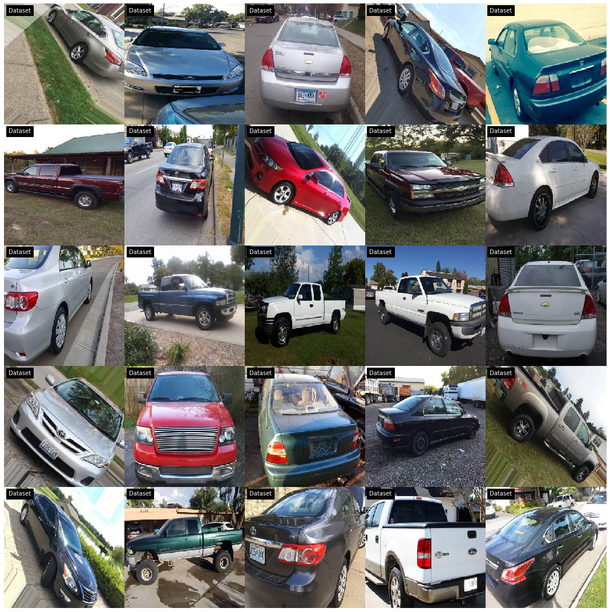

# Data Wrangling with VMMRdb

Understanding ways to prepare the data set for machine learning and training. The dataset can be downloaded from [VMMR](http://vmmrdb.cecsresearch.org/). A subset of the relevant data used for training. Download the dataset and place it in a folder ../Dataset/SubsetVMMR

Here are the 10 most stolen used cars according to the NICB, with the most “popular” model year noted along with the total number of units from all model years taken:
- Honda Civic (1998): 45,062
- Honda Accord (1997): 43,764
- Ford F-150 (2006): 35,105
- Chevrolet Silverado (2004): 30.056
- Toyota Camry (2017): 17,276
- Nissan Altima (2016):  13,358
- Toyota Corolla (2016): 12,337
- Dodge/Ram Pickup (2001): 12,004
- GMC Sierra (2017): 10,865
- Chevrolet Impala (2008): 9,487

###  Select and Merge Interested Classes

Merging cars that are the same Make/Model but look at the years nearby since cars usually look the same for 3-4 years before changing styles. Below we will see the distribution of the data.

### Create Train, Validation and Test Folders

Creating training, validation and test folders for data ingestion and we'll use 0.7, 0.1, 0.2 ratio

### Sample Augmentation

While looking at our distribution above we saw that certain classes were significantly lower than others.  To help mitigate that issue we're going to augment some of our data set so that we have a dataset that is more closely distributed.

### Look at Distribution of Selected Classes again

Now that we've done some augmentation to the dataset we want to see how the distribution has changed compared to before the augmentation.  In this case we're only going to be looking at the train folder, since we only augmented the train dataset.

### Final Look after Augmentation and Resizing

## Citations

A Large and Diverse Dataset for Improved Vehicle Make and Model Recognition F. Tafazzoli, K. Nishiyama and H. Frigui
In Proceedings of the IEEE Conference on Computer Vision and Pattern Recognition (CVPR) Workshops 2017. 
