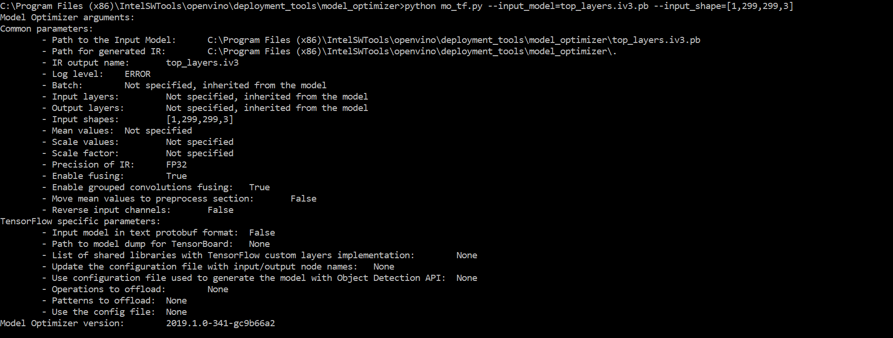

# Inference at Edge with Intel distribution of OpenVINO Toolkit

- Installation instructions can be found on this link https://software.intel.com/en-us/openvino-toolkit/choose-download

- Follow the instructions for TensorFlow

- Test out the examples before we begin the inference

- Before running inference, you will need to convert the frozen graph obtained from training to Intermediate Representation using the Model Optimizer (MO)

Deployment of deep neural networks using Intel Openvino Toolkit is done in the following steps :

- Once you have the frozen tensorflow model, set the openvino environment by running the setupvars.sh (Linux) or setupvars.bat (Windows) script from your C:\Program Files (x86)\IntelSWTools\openvino\bin\

## Model Optimizer

- After the Environment is initialized, run the Model Optimizer for TensorFlow that quantizes and optimizes the topology creating an Intermediate representation (IR) file.

- Model optimizer performs generic optimization, FP16/FP32 quantization and Drop unused layers.

- The output is an Intermediate represntation of the optimized model, you will have an .xml & .bin files

- Your output should look similar to this

## Runtime Inference

- Indentification of stolen cars

- In same initialized environment, run the Inference_GUI.py script, you can see a working solution to the problem of creating a car theft classification application using Intel hardware and software tools.

- In the GUI select the XML file generated by the Model optimizer, the labels file, test samples and also you can configure to run the inference on CPU, GPU or Movidius hardware. 

