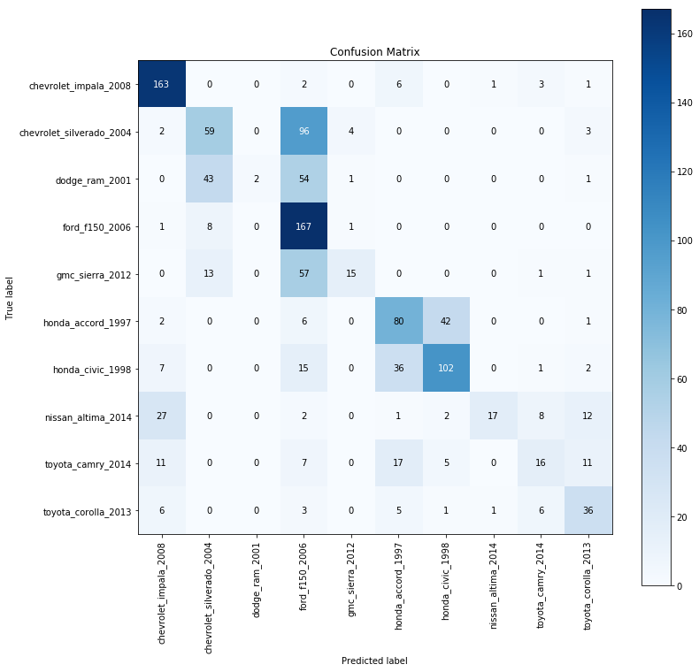

# Model Analysis of InceptionV3 Training

Interpreting the results of our training by analyzing out model with different metrics and graphs. A common graph to plot for analysis is a confusion matrix. It will play out the true label vs the predicted label on a graph and color code them accordingly. The ideal confusion matrix will have a diaganol line from the top left to the bottom right and no other color. This means that each predicted value matched the true value. What you'll normally see is that each class might lean toward one or two other classes that might look similar to the true class.

Tthe predict_generator from Keras was used in our test data set generator. This will generate predictions from the input samples of the data generator which we will pass in to our analysis functions. We also want to get the correct classes from the generator so we'll store them in the variable true_classes for easy access to them later. 

## Confusion Matrix

Like wise the precision, recall and F1 score were computed from sklearn metrics

## Transform Keras Model to Tensorflow Frozen Graph

Keras utilizes the h5 or hdf5 file format when saving its model. If we want to use our model outside of Keras, in OpenVINO, we need a frozen pb file to pass in when using a Tensorflow model. We can do that directly from Keras by utilizing the below functions.

First we need to make sure that you set the learning phase to 0 or you might end up not correctly getting the output node from the session. Then we grab the session and output names and pass them to graph_util.convert_variables_to_constants.
