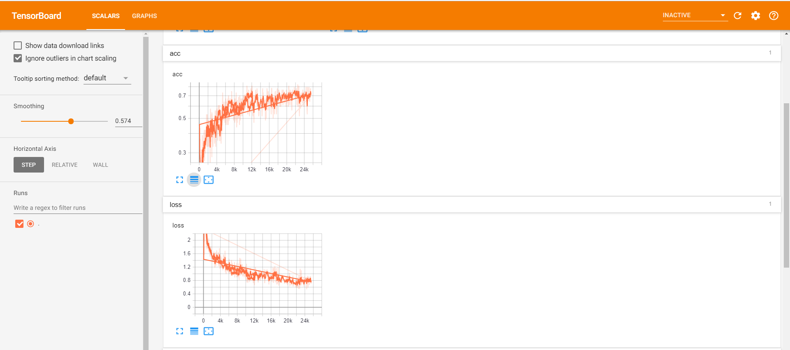
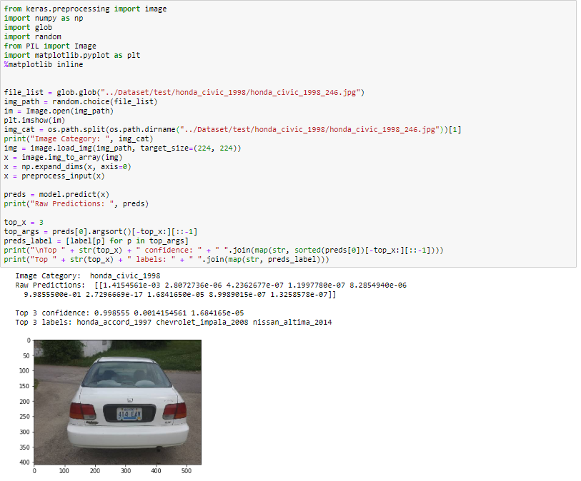
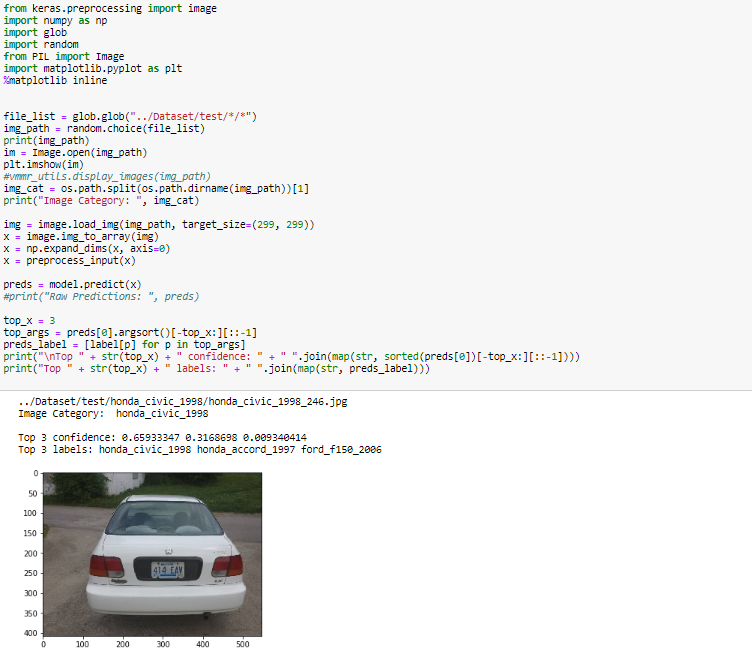

### Preparing for training using the Keras with TensorFlow as a backend with folowing topologies
 
- Inception v3
- VGG16
- MobileNet

Initiate the training and learn about the relationship between accuracy and loss, Comparing the performance of the three Neural Networks. Evaluation and testing on a sample image and then freezing the model for use outside Keras.

Most of the code in the notebook is self-exploratory, training the neural networks was done on Intel Dev cloud. Please look [here](https://devcloud.intel.com/datacenter/learn/getting-started/ "here") for getting started with Dev cloud environment to train your models. 

The training progress of the Neural network can be traced using Tensor Board. Shown here is the training (accuracy and loss graphs) of InceptionV3 Net.

Three significant factors were considered while selecting our topology or network as the plan for inference is on an edge device
- Time to train : Depending on the number of layers and computation required, a network can take a significantly shorter or longer time to train.

- Size : Since we're targeting edge devices and an Intel® Movidius™ Neural Compute Stick, we must consider the size of the network that is allowed in memory as well as supported networks

- Inference Speed : Typically the deeper and larger the network, the slower the inference speed. In our use case we are working with a live video stream; we want at least 10 frames per second on inference

- Accuracy : It is equally important to have an accurate model

The [original paper](http://vmmrdb.cecsresearch.org/papers/VMMR_TSWC.pdf "original paper") was trained on ResNet-50

## Transfer Learning

Transfer learning is taking the weights from a previously trained network and use them as the basis for the weights in a new network. Since there is a difference in number of categories between data sets we normally remove the top layers of the network and re-instantiate them to match the number of categories we're trying to choose between. Using Transfer Learning will significantly speed up your training process by utilizing things like edge detection that the previous training has already learned then you can fine tune the network to your data set

## Model Comparision
After training and comparing the performance and results based on the previously discussed criteria, our final choice of Network was Inception V3
Out of the three networks
### MobileNet was the least accurate model (74%) but had the smallest size (16mb)

### VGG16 was the most accurate (89%) but the largest in size (528mb) and Top-5 categorical accuracy was 88.90%, shown here is the inference of VGG16 on one sample image

### InceptionV3 had median accuracy (83%) and size (95.8mb) and Top-5 categorical accuracy was 97.90%, shown here is the inference of InceptionV3 on one sample image

Based on the above results, the model choice for Inference using Intel OpenVINO Toolkit was InceptionV3 Net as it exhibited considerable accuracy with moderate model size suitable for real time inference on edge devices.

## Citations

- Rethinking the Inception Architecture for Computer Vision, Christian Szegedy, Vincent Vanhoucke, Sergey Ioffe, Jonathon Shlens, Zbigniew Wojna

- VeryDeep Convolutional Networks for Large-Scale Image Recognition KarenSimonyanand Andrew Zisserman,2014

- MobileNets: Efficient Convolutional Neural Networks for Mobile Vision Applications
